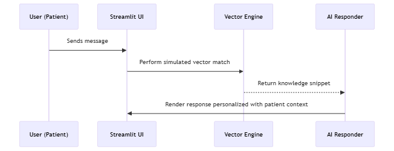

# 🏗️ Technical Architecture – Healthcare Engagement AI Platform

This document outlines the system design and implementation details for a conversational AI platform simulating patient engagement in a healthcare context. Inspired by Brado’s Catherine™ platform and related use cases, this project explores how domain-specific agents can drive patient outcomes through personalized, data-informed interaction.


## 🎯 System Goals

- Support pre-surgical patient journeys (e.g., orthopedic care)
- Provide empathetic, personalized AI conversations
- Simulate domain-relevant vector search using structured knowledge
- Track engagement and healthcare KPIs via real-time analytics
- Build a modular system design that could evolve toward production readiness


## 🧱 System Components

### 1. Conversational AI Engine
- Accepts user input and context (e.g. “I'm worried about surgery pain”)
- Retrieves relevant medical knowledge based on keyword/context matching
- Generates tailored responses using:
  - Patient profile (age, surgery type, anxiety level, comorbidities)
  - Conversation history
  - Source-annotated knowledge snippets

> Implements a simulated vector retrieval engine with basic confidence boosting based on relevance and context alignment.


### 2. Knowledge Retrieval Layer

| Element             | Function                                                                 |
|---------------------|--------------------------------------------------------------------------|
| **Knowledge Base**  | Static healthcare knowledge entries tagged with keywords, confidence scores, and citations |
| **Simulated Retrieval** | Keyword match + optional patient-context boosting (e.g., comorbidity awareness) |
| **Fallback Handling**   | Default educational response with general tone if no confident match |


### 3. Patient Context Engine

- Loads a structured patient profile at app start (e.g., Jane Doe, 67)
- Includes comorbidities, prior surgeries, support system, anxiety level
- Adjusts tone and content of responses to fit the patient's background


### 4. Analytics & Outcome Tracking


- Simulated metric generation for:
  - Daily Conversations
  - Patient Satisfaction Score
  - Anxiety Reduction (modeled)
  - Average Session Duration
- Visualized with Plotly in a separate dashboard tab
- Metrics reflect hypothetical engagement outcomes as seen in healthcare AI case studies


## 🖼️ UI Architecture

```
┌──────────────────────────────────────┐
│ Streamlit App                        │
│ ┌──────────────────────────────┐     │
│ │ Patient Chat (LLM Simulation)│     │
│ └──────────────────────────────┘     │
│ ┌──────────────────────────────┐     │
│ │ Analytics Dashboard          │     │
│ └──────────────────────────────┘     │
│ Sidebar: Patient Profile             │
└──────────────────────────────────────┘
```

- **Patient Tab**: Conversational interface with avatars and personalized messages
- **Analytics Tab**: Simulated real-time KPI monitoring for provider-side insight
- **Sidebar**: Dynamic patient metadata, updated on app restart/reset


## 🧮 Data Flow

### Patient Message Flow




## 📦 Technologies Used

| Area              | Tool/Library               |
| ----------------- | -------------------------- |
| UI Framework      | Streamlit                  |
| Data & State      | Pandas, SessionState       |
| Visualization     | Plotly                     |
| AI Simulation     | Python logic (custom)      |
| Deployment Ready  | Streamlit local/server     |


## 🔧 Scalability Considerations

While this is a simulated demo, the following were designed with production extension in mind:

| Area           | Potential Upgrade Path                                      |
| -------------- | ----------------------------------------------------- |
| Knowledge Base | Swap for vector DB (e.g., Pinecone, Chroma) + embeddings       |
| AI Backend     | Integrate LLM APIs (OpenAI, Azure, open-source)          |
| Session State  | Externalize using Redis or cloud session stores       |
| Deployment     | Docker or Streamlit Cloud            |


## ✔️ Summary

This architecture explores how an AI-powered system might simulate meaningful healthcare conversations while supporting outcome tracking and patient-centered design. While the system runs statically with simulated logic, it lays the groundwork for Retrieval-augmented generation (RAG) agents.
